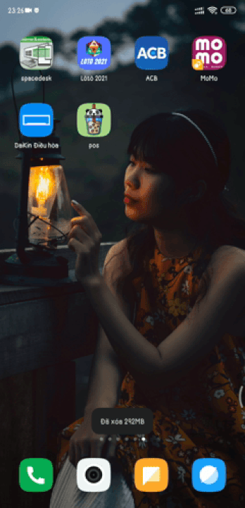
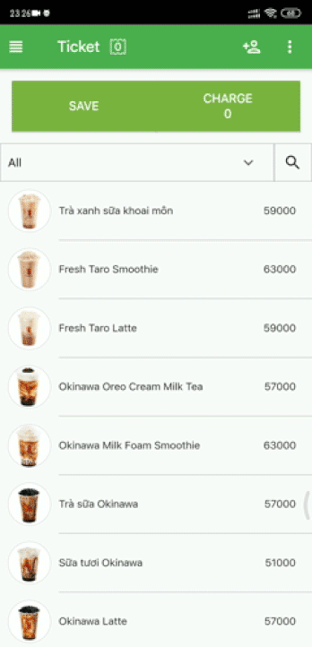
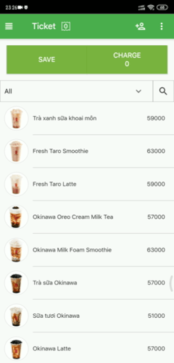
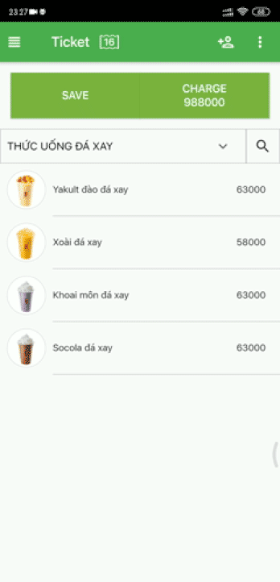
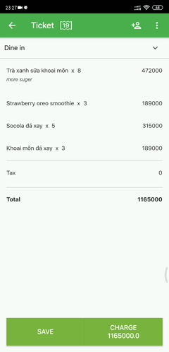

# pos_flutter_client

pos app

## Getting Started

This project is a starting point for a Flutter application.

A few resources to get you started if this is your first Flutter project:

- [Lab: Write your first Flutter app](https://flutter.dev/docs/get-started/codelab)
- [Cookbook: Useful Flutter samples](https://flutter.dev/docs/cookbook)

## Important ingredients 
- [State Management Getx](https://pub.dev/packages/get#state-management)
- [Dependency management Getx](https://pub.dev/packages/get#dependency-management)
- [Route Management Getx](https://pub.dev/packages/get#route-management)

## Plugin 

- [Dart data class](https://plugins.jetbrains.com/plugin/12429-dart-data-class)
- [Json to dart](https://plugins.jetbrains.com/plugin/12737-json-to-dart-class-jsontodartclass-)

## rule

- Separation of business logic with Ui
- Ui will be updated through GetxController

## Screenshots

