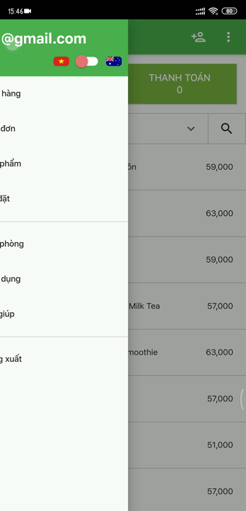

POS App
## State Management Versions 

- [State Management with Getx](https://github.com/phucdzvcll/pos_flutter_client/tree/main)
- [State Management with BloC](https://github.com/phucdzvcll/pos_flutter_client/tree/bloc)
## Important ingredients 

- [State Management BloC](https://bloclibrary.dev/#/)
- [Dependency management Getx](https://pub.dev/packages/get#dependency-management)
- [Multi language](https://pub.dev/packages/easy_localization)
- [Firebase](https://firebase.flutter.dev/)
## Plugin 

- [Dart data class](https://plugins.jetbrains.com/plugin/12429-dart-data-class)
- [Json to dart](https://plugins.jetbrains.com/plugin/12737-json-to-dart-class-jsontodartclass-)

## Rule

- Separation of business logic with Ui
- Ui will be updated through GetxController

## Screenshots

## Dev Tools Screenshots

